# Blueprint CSS placeholder images

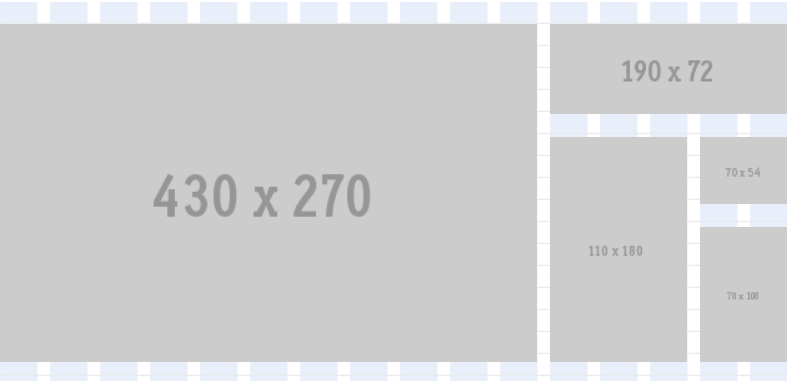

Blueprint placeholders is a collection of nearly **750 placeholder images**, optimized for the Blueprint CSS grid, useful for **quickly prototyping designs**.

* Project: Blueprint placeholders
* Version: 1.0.0
* Author: Gareth J M Saunders
* Description: Placeholder images for use with Blueprint CSS v.1.0.1 and lower.
* Last updated: Monday 4 July 2011

**This is a resource for the original Blueprint CSS framework (not v3.x which uses CSS Grid and Flexbox) and is provided for reference and archive purposes.**

---

## About

This project arose out of a need I had for placeholder images on a Web project that I was working on at the [University of St Andrews](www.st-andrews.ac.uk).

I kept having to look-up the Blueprint grid.css or my own cheatsheet to work out image dimensions and wished that I could have a set of ready-made images that followed the Blueprint grid class names, to make them easy to use.

Having created the grid-based images down to 25 rows (450px) I created a bunch
of other, hopefully, useful images too.  I hope you find them as useful as I do.

---

## Features

Most of the images in this collection use the familiar **Blueprint class names** `span-1` to `span-24` (e.g. `span-4.gif`) and are overlaid with the images's
dimensions which makes them **quick and easy to use**. There are a number of
ready-made sets:

### 1. Grid
Images to fit every combination of the grid down to 25 rows.

* 600 images
* 24 columns &times; 25 rows

### 2. Ratio

* Images in both 4:3 (standard) and 16:9 (widescreen) ratios, spanning 1 to 24 columns.
* All images are rounded up or down to the nearest pixel.

### 3. Ratio grid
* Images in both 4:3 (standard) and 16:9 (widescreen) ratios, optimized for the grid.
* All images are rounded up or down to the nearest line-height value to fit the grid.

### 4. Square
* If rectangles aren't your thing then how about squares?
* There are two sets: one fits the columns, the other fits the line-height (rows).

### 5. Extras
As well as the basic images above you also get images for specific purposes:

* Adverts
* Amazon banners
* Badges
* Google maps
* Icons
* Vimeo videos
* YouTube videos

All images were created using the excellent http://placehold.it/
by Brent and Russell.

---

## 1. Grid

The **grid** option enables you to use **any combination of column (1-24) and
row (1-25)** to keep your design **true to the Blueprint grid**. Rows are measured
by line-height (multiples of 18px). There are 600 images.

The format for grid-based images is simple:

    /grid/span-{number of columns}-rows-{number of rows}.gif

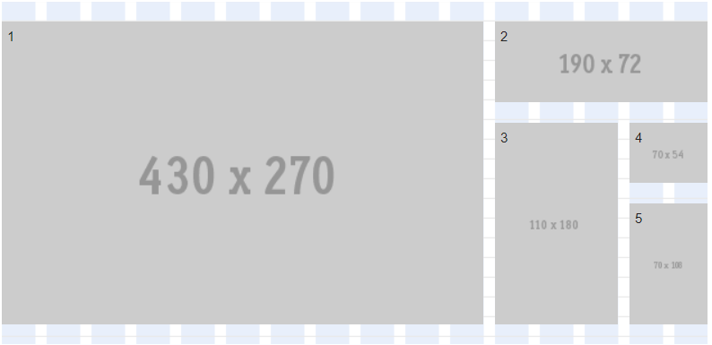

The above examples are:

1. `/grid/span-11-rows-15.gif`
2. `/grid/span-5-rows-4.gif`
3. `/grid/span-3-rows-10.gif`
4. `/grid/span-2-rows-3.gif`
5. `/grid/span-2-rows-6.gif`

---

## 2. Ratio

The **ratio** set gives you either **4:3 (standard ratio)** or **16:9 (widescreen ratio)** images. These images are designed to **perfectly fit the columns of the Blueprint grid**. You will notice that the images _do not_ fit the rows of the grid.

The format for ratio-based images is simple:

Standard (4:3) ratio image

    /ratio/span-{number of columns}.gif

Widescreen (16:9) ratio image

    /ratio/span-{number of columns}-wide.gif

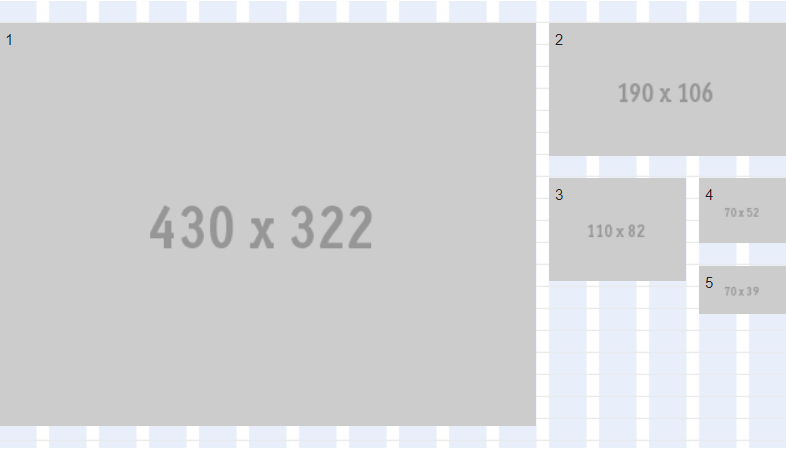

The above examples are:
    
1. `/ratio/span-11.gif`
2. `/ratio/span-5-wide.gif`
3. `/ratio/span-3.gif`
4. `/ratio/span-2.gif`
5. `/ratio/span-2-wide.gif`

---

## 3. Ratio grid

The **ratio grid** set is exactly the same as the ratio set (offering either **4:3 (standard ratio)** or **16:9 (widescreen ratio)** images) except that these images are now either rounded-up or rounded-down (&plusmn; 10px) to the nearest line-height value making them fit the grid exactly.

The format for ratio-based images is simple:

Standard (4:3) ratio image

    /ratiogrid/span-{number of columns}.gif

Widescreen (16:9) ratio image

    /ratiogrid/span-{number of columns}-wide.gif

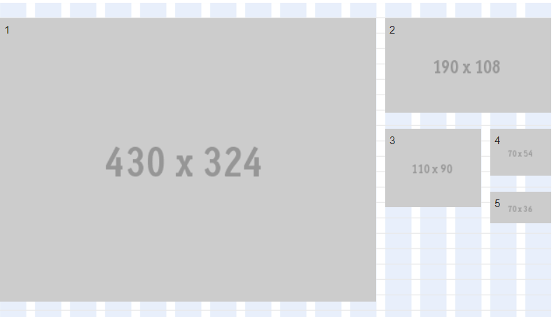

The above examples are:

1. `/ratiogrid/span-11.gif`
2. `/ratiogrid/span-5-wide.gif`
3. `/ratiogrid/span-3.gif`
4. `/ratiogrid/span-2.gif`
5. `/ratiogrid/span-2-wide.gif`

---

## 4. Square

There are **two options for squares**: you can fit them to the **width of a column** or to the **height of a line-height row** (in multiples of 18px).

The format for square images is simple:

Square determined by the width of the columns

    /square/span-{number of columns}.gif

Square determined by the height of the rows

    rows-{number of rows}.gif

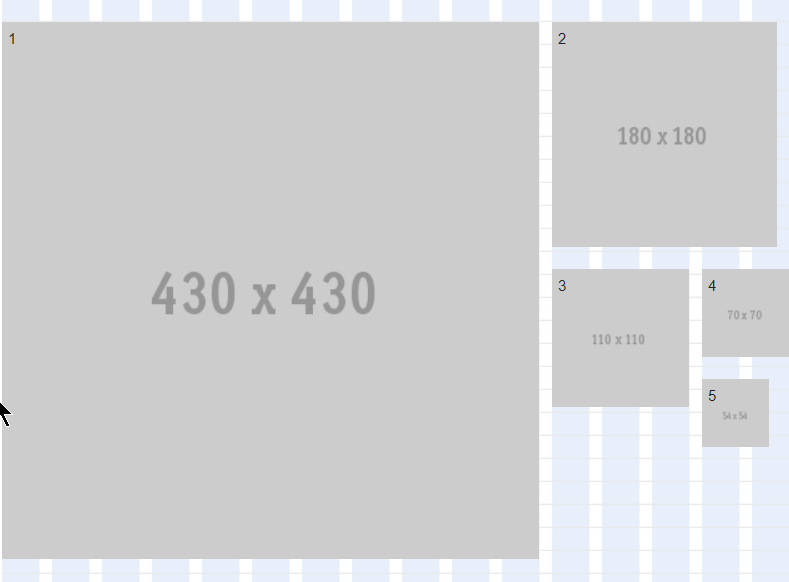

The above examples are:

1. `/square/span-11.gif`
2. `/square/rows-10.gif`
3. `/square/span-3.gif`
4. `/square/span-2.gif`
5. `/square/rows-3.gif`

---

## 5. Extras

There are also a number of extras:

### a) Adverts

The [Interactive Advertising Bureau (IAB)](http://www.iabuk.net/) ad unit guidelines are intended for marketers, agencies and media companies for use in the creating, planning, buying and selling of interactive marketing and advertising. They regularly update agreed standard sizes. This set contains both core and delisted standards:

#### Core adverts

    button 2            120 x 60
    half page ad        300 x 600
    leaderboard         728 x 90
    medium rectangle    300 x 250
    microbar            88 x 31
    rectangle           180 x 150
    wide skyscraper     160 x 600

#### Delisted

    3:1 Rectangle       300 x 100
    Button 1            120 x 90
    Full banner         468 x 60
    Half banner         234 x 60
    Large Rectangle     336 x 280
    Pop-Under           720 x 300
    Skyscraper          120 x 600
    Square Pop-Up       250 x 250
    Square button       125 x 125
    Vertical Rectangle  240 x 400
    Vertical banner     120 x 240

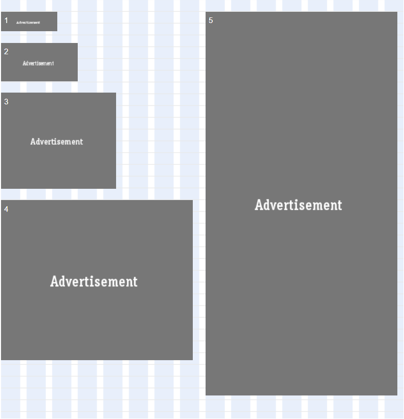

The above examples are:

1. `/extras/adverts/core/microbar.gif`
2. `/extras/adverts/core/button2.gif`
3. `/extras/adverts/core/rectangle.gif`
4. `/extras/adverts/core/mediumrectangle.gif`
5. `/extras/adverts/core/halfpagead.gif`

---

### b) Amazon banners

The Amazon Affiliates programme enables you to make money advertising Amazon
products (up to 10% in referral fees). Amazon provides a number of ready-made
affiliate links and banners. This set contains the most common, standard Amazon
banner sizes:

    88 x 31
    100 x 70
    120 x 60
    120 x 90
    160 x 600
    234 x 60
    468 x 60
    728 x 90

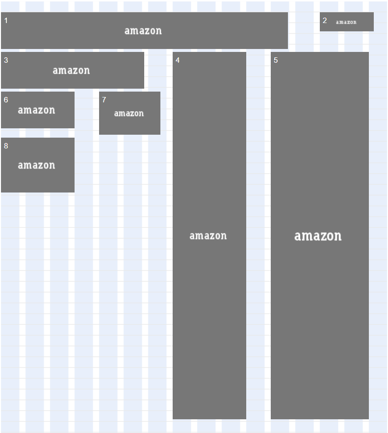

The above examples are:

1. `/extras/amazon/468x60.gif`
2. `/extras/amazon/88x31.gif`
3. `/extras/amazon/234x60.gif`
4. `/extras/amazon/120x600.gif`
5. `/extras/amazon/160x600.gif`
6. `/extras/amazon/120x60.gif`
7. `/extras/amazon/100x70.gif`
8. `/extras/amazon/120x90.gif`

---

### c) Badges

Web badges are often used to promote web standards, software used to create
websites, content licenses, etc. This set contains 7 popular sizes:

    36 x 13
    80 x 15 (also available as 'blueprint.gif')
    88 x 31
    110 x 32
    120 x 60
    125 x 50
    180 x 60

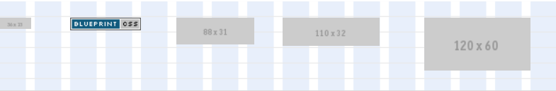

---

### d) Google maps

Available at the default embed size (425 &times; 350) as `map.gif`, `satellite.gif`, `terrain.gif` or `earth.gif`. As I needed these example maps to be of somewhere real I chose St Andrews, which is where I went to university and where I worked when I created these.

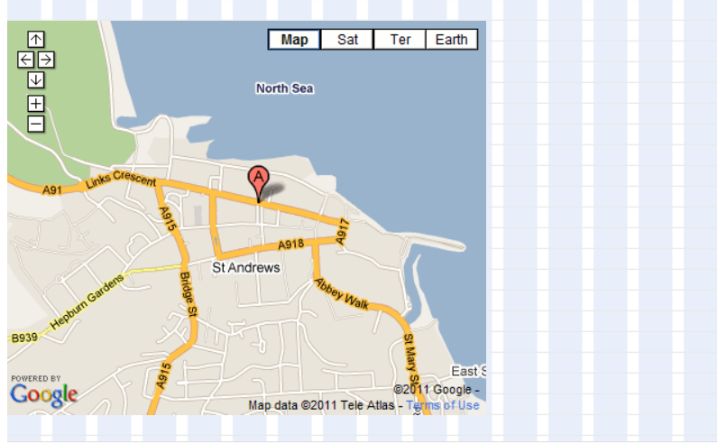

---

### e) Icons

The most popular icon sizes are represented here

    12 x 12
    12 x 19
    16 x 16
    16 x 25
    19 x 19
    24 x 24
    24 x 38
    25 x 25
    29 x 29
    32 x 32
    36 x 36
    38 x 38
    48 x 48
    50 x 50
    57 x 57
    58 x 58
    64 x 64
    72 x 72
    96 x 96
    114 x 114
    128 x 128
    256 x 256
    512 x 512

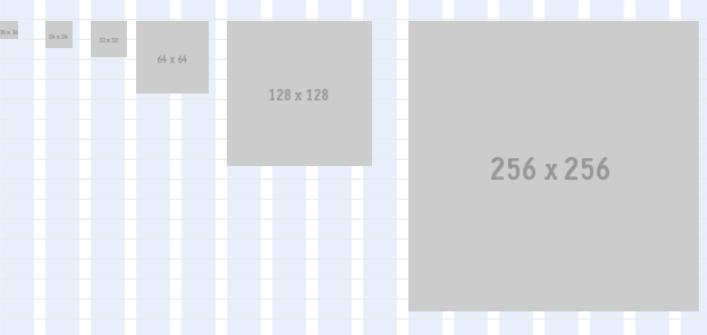

---

### f) Vimeo

Current default sizes offered by Vimeo:

    small       400 x 225
    medium      640 x 360

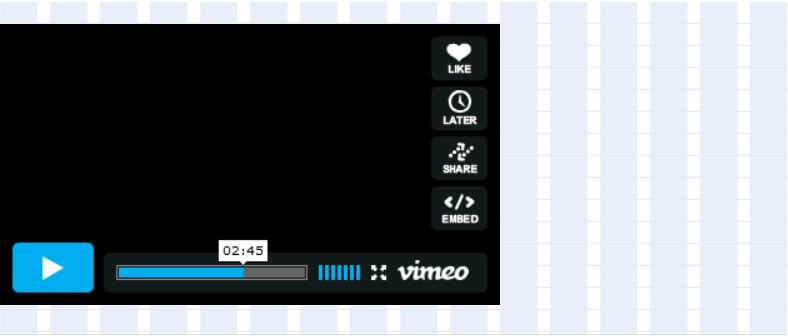

---

### g) YouTube

Current default sizes offered by YouTube:

    4:3 ratio
    small           425 x 349
    default         480 x 390
    medium          640 x 510
    large           960 x 750

    16:9 ratio
    small-wide      560 x 349
    default-wide    640 x 390
    medium-wide     853 x 510
    large-wide      1280 x 750

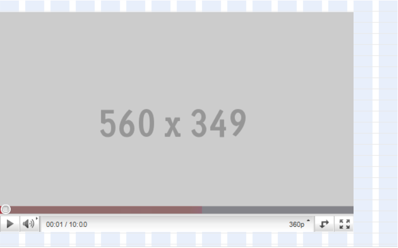

---

## About Blueprint CSS framework

Blueprint (https://github.com/joshuaclayton/blueprint-css) is a CSS framework which aims to cut down on your development time.

It gives you a solid foundation to build your project on top of, with an easy-to-use grid, sensible typography, useful plugins, and even a stylesheet for printing.

---

## License

This work is licenced under a GNU general public license version 3. In short, if you make a derivative work using this as your source and distribute it to others then you must do likewise.
